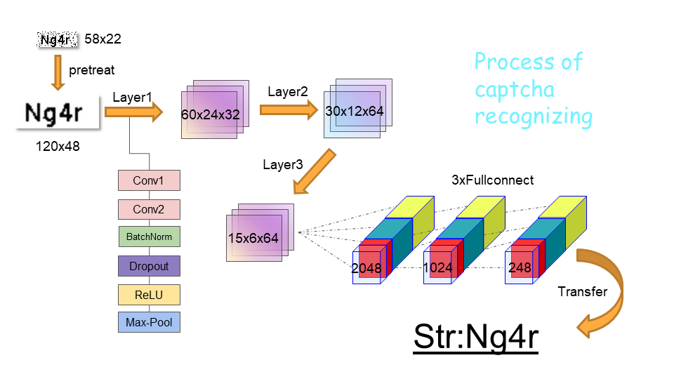

# AutoElective2.0

<font color=#999AAA >基于Web自动化测试与卷积神经网络自主开发的可视化选课应用
</font>

 

# 前言

* 本项目基于selenium<sup id="a1">[1](#f1)</sup>Web应用程序测试，使用Pytorch<sup id="a2">[2](#f2)</sup>框架下定义的卷积神经网络识别验证码，并利用Chrome浏览器进行自动化刷课操作。

* 本项目适用于北京大学选课网，提供可视化的人机交互界面，致力于为北京大学本科生在补退选/补选阶段选到心仪课程提供新的解决方案。

# **警告！**

* 请不要尝试在服务器访问高峰期（比如开放补选的3小时内）使用自动刷课工具，否则可能引发未知的错误。
* 自动刷课工具运行过程中禁止更改选课计划。
* 尽量不要在0s附加刷新速率的模式下运行。
* 选课目标分布在多个页面时会影响刷新速率。
* 为了防止与开发者发生利益冲突，发行版的部分源代码做了加密处理，且抢课算法有适当延时。

# 特点
* 提供可视化界面，方便操作，可实时监控程序运行进程。
* 支持多页抢课，只要指定课程与班号就可以进行刷课，不需要做额外配置。
* 验证码CNN识别准确率较高（>92%）
* 抢课速度较快 （开发版<0.2s，发行版<2.2s）

# 使用方法

## 1.环境配置
<font color=#DC143C>首先要保证shell运行在项目根目录下！</font>
### (1)安装[python3](https://www.python.org/)
### (2)安装[Pytorch](https://pytorch.org/)
从 PyTorch 官网 中选择合适的条件获得下载命令，然后复制粘贴到命令行中运行即可下载安装。
推荐选项：

- `PyTorch Build`:  Stable (1.6.0)
- `Your OS`: Windows
- `Package`: Pip
- `Language`: Python
- `CUDA`: None（有N卡的可以选择对应的CUDA版本）

ps：[Pytorch下载缓慢的解决方案](https://blog.csdn.net/sinat_33896833/article/details/103252069)
### (3)下载对应版本的浏览器驱动
* [Chrome浏览器驱动](http://chromedriver.storage.googleapis.com/index.html)
* [Edge浏览器驱动](https://developer.microsoft.com/en-us/microsoft-edge/tools/webdriver/)
* [Firefox浏览器驱动](https://github.com/mozilla/geckodriver/releases)
* [IE浏览器驱动](http://selenium-release.storage.googleapis.com/index.html)

ps：请在浏览器设置的“关于”中查询浏览器版本号。
### (4)安装第三方依赖库
```
pip install -r requirement.txt
```


## 2.运行程序
输入指令：
```
python main.py
```
该指令会打开一个初始化界面：


&emsp;按照界面提示选择浏览器，填写学号与密码。确保对应浏览器驱动已经放在WebdriverPath显示的路径中，且文件名一致。然后在右侧按照格式要求填写目标课程名称与班号，进行一些设置后点击“开始”即可自动刷课。

### 注：邮件提醒功能
&emsp;如果想要在选课成功或者特定的一些时间收到程序的邮件通知，请在email.txt中完善个人邮件信息。

&emsp;程序要自动发送邮件需要至少一个发件邮箱和一个收件邮箱（可以都是自己的邮箱，即自己给自己发邮件），且发件邮箱必须开启SMTP<sup id="a3">[3](#f3)</sup>功能。请自行在网上查阅如何开启邮箱SMTP并查看对应的授权码。以下是填写规范（email.txt）：
* 第一行：邮箱服务器地址（例：qq邮箱对应smtp.qq.com）
* 第二行：收件邮箱（自己的邮箱 例：***@qq.com）
* 第三行：发件邮箱（可以是自己的邮箱）的smtp授权码

# 结构与原理
## 1.项目主体结构
```
./AutoElective2.0/
├── captcha           //捕获的验证码图片(.png)
├── dataset           //训练数据集
├── loss             //损失曲线
├── model            //训练好的模型
├── paper             //参考文献
├── qt            //界面相关文件
    ├── ui            //界面定义
    ├── pics          //界面图文
    └── save          //用户信息缓存
├── show            //图文材料
├── webdriver         //浏览器驱动
├── website            //官网源代码
├── AutoElective.py         //主程序
├── cnn.py         //定义卷积神经网络
├── constant.py         //定义常量
├── data_analyze.py          //模型分析
├── generate.py          //验证码生成器（已废弃）
├── gui.py         //启动界面
├── LoginAttack.py            //自动标签数据集获取
├── main.py          //入口文件（启动器）
├── options.py             //定义枚举
├── pretreatment.py           //图片预处理（降噪、二值化、上采样等）
├── test.py               //模型测试
├── thread_control.py            //多线程处理
├── train.py               //模型训练
├── transfer.py            //向量字符转换
├── requirements.txt           //依赖库
└── email.txt             //用户邮箱信息

```

## 2.运行逻辑

### (1)主逻辑

&emsp;项目主界面文件gui.py利用Pyqt库生成可交互界面，并实例化一个定义在AutoElective.py中的Electool对象，该对象能够利用selenium与浏览器驱动模仿人类进行自动登录，点击，读取信息，刷新等一系列操作。Electool通过不断刷新网页嗅探可能出现的空余选课名额，发现名额后立刻识别验证码进行抢课。如果抢到课程，程序会以邮件或声音的方式提醒用户，否则将继续进行刷课。

### (2)验证码的识别
&emsp;我们知道，自动抢课程序实现的主要难点在于验证码识别这一关。为了解决这个问题，我们考虑采用目前较为流行的CNN卷积神经网络方法，通过简单的机器学习赋予程序自动高准确度填写验证码的能力。

&emsp;选课网站生成的验证码为四位大小写字母与数字组合的形式，且带有随机产生的噪点（noise）。为了降低识别难度，我们首先利用pretreatment.py对图片进行预处理，包括降噪、二值化、上采样等，这样就能够得到较为清晰的验证码图片。接着，我们需要一个卷积神经网络将处理后的图片映射成长向量的形式，并通过一定规则下的转换将该向量变为含有四个字符的字符串，这样就得到了识别结果。

&emsp;以下详细介绍如何得到一个识别精度较高的卷积神经网络：

#### (i)训练集的获取
&emsp;北京大学门户登录入口提供随机生成的四位验证码，我们只要通过连续的get请求下载图片即可获得大量原始验证码数据。然而，想要获得准确无误的标签数据集却没有那么容易。采用人工的方式不仅费时费力，而且准确性与数据量也无法保证。


&emsp;那么如何在短时间内快速生成大量带有标签的数据呢？其实，我们可以利用网页后端服务器本身就带有比对验证功能，换句话说，可以“化敌为友”，利用服务器本身为我们的原始数据“打标签”。于是，基于OCR<sup id="a4">[4](#f4)</sup>与服务器的后端逻辑，我们不难设计出自动产生准确标签数据集的程序。

&emsp;具体实现方法如下：

* 通过模拟用户操作的方式下载登录入口提供的验证码图片

* 将验证码图片作预处理，并交由成熟的OCR系统进行字符识别

* 将识别结果回填网页并提交表单

* 若得到服务器的正确反馈则按照识别结果给图片打上标签，否则删除该图片

* 刷新页面

&emsp;不断重复上述过程，理论上我们就可以得到一个有足够数据量的完美标签数据集了。在实践过程中，OCR的识别精度大约在55%，因此会有一半左右的图片会被废弃掉，留下一半完全正确标注的图片，整体效率较高。

#### (ii)神经网络的结构与训练过程


&emsp;本项目使用的神经网络结构为3个卷积层+3个全连接层，并搭配一定程度的dropout防止过拟合（具体参考cnn.py）。该神经网络能够将特定大小的四位验证码图片映射成一个长向量，该长向量经过特定方式的翻译转换（transfer）后可以得到四位字符响应，此即识别结果。

&emsp;训练时将数据集（10000+数据量，已经过预处理）以64个为一个batch进行打包并随机抽样，经过200000次迭代后观察到loss曲线收敛，从而得到最终的训练结果，保存为pth文件。

&emsp;通过不断调节超参数，并经过多次训练，最终得到的效果最好的模型在测试数据集上的识别精度为92.53%。


### (3)多线程处理
&emsp;交互界面的线程与刷课线程互相独立，两者之间通过signal（信号）进行信息传递。即前台向后台发送指令，后台将运行情况反馈到前台并进行显示。这种处理方式保证了程序能够稳定运行。

&emsp;此外，在查找目标课程的过程中也采用了多线程分发任务的方法，加速了查找速度（<0.1s/次）。


- - -
# 注释

<b id="f1">1</b> Selenium是一个用于Web应用程序测试的工具。Selenium测试直接运行在浏览器中，就像真正的用户在操作一样。支持的浏览器包括IE（7, 8, 9, 10, 11），Mozilla Firefox，Safari，Google Chrome，Opera等。这个工具的主要功能包括：测试与浏览器的兼容性——测试你的应用程序看是否能够很好得工作在不同浏览器和操作系统之上。测试系统功能——创建回归测试检验软件功能和用户需求。支持自动录制动作和自动生成 .Net、Java、Perl等不同语言的测试脚本。 [↩](#a1)

<b id="f2">2</b> PyTorch是一个开源的Python机器学习库，基于Torch，用于自然语言处理等应用程序。2017年1月，由Facebook人工智能研究院（FAIR）基于Torch推出了PyTorch。它是一个基于Python的可续计算包，提供两个高级功能：1、具有强大的GPU加速的张量计算（如NumPy）。2、包含自动求导系统的的深度神经网络。 [↩](#a2)

<b id="f3">3</b> SMTP是一种提供可靠且有效的电子邮件传输的协议。SMTP是建立在FTP文件传输服务上的一种邮件服务，主要用于系统之间的邮件信息传递，并提供有关来信的通知。SMTP独立于特定的传输子系统，且只需要可靠有序的数据流信道支持，SMTP的重要特性之一是其能跨越网络传输邮件，即“SMTP邮件中继”。使用SMTP，可实现相同网络处理进程之间的邮件传输，也可通过中继器或网关实现某处理进程与其他网络之间的邮件传输。[↩](#a3)


<b id="f4">4</b> OCR （Optical Character Recognition，光学字符识别）是指电子设备（例如扫描仪或数码相机）检查纸上打印的字符，通过检测暗、亮的模式确定其形状，然后用字符识别方法将形状翻译成计算机文字的过程；即，针对印刷体字符，采用光学的方式将纸质文档中的文字转换成为黑白点阵的图像文件，并通过识别软件将图像中的文字转换成文本格式，供文字处理软件进一步编辑加工的技术。如何除错或利用辅助信息提高识别正确率，是OCR最重要的课题，ICR（Intelligent Character Recognition）的名词也因此而产生。衡量一个OCR系统性能好坏的主要指标有：拒识率、误识率、识别速度、用户界面的友好性，产品的稳定性，易用性及可行性等。 [↩](#a4)

- - -
# 参考资料
* [Selenium官方文档](https://www.selenium.dev/selenium/docs/api/py/api.html)
* [Selenium-Python中文文档](https://selenium-python-zh.readthedocs.io/en/latest/)
* [Pytorch中文文档](https://pytorch-cn.readthedocs.io/zh/latest/)