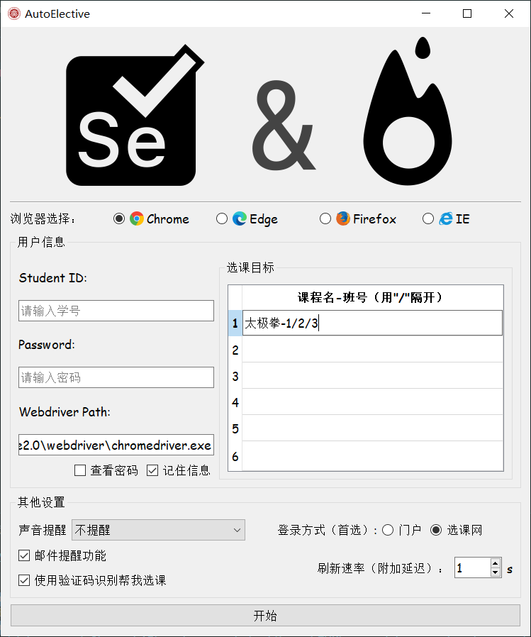

# AutoElective3.0

<font color=#999AAA >基于Web自动化测试与卷积神经网络自主开发的可视化选课应用
</font>

 

# 前言

* 本项目基于selenium<sup id="a1">[1](#f1)</sup>Web应用程序测试，使用TT识图<sup id="a2">[2](#f2)</sup>识别验证码，并利用浏览器驱动进行自动化刷课操作。

* 本项目适用于北京大学选课网，提供可视化的人机交互界面，可以为北京大学本科生在补退选/补选阶段选到心仪课程提供新的解决方案。


# **警告！**

* 请不要尝试在服务器访问高峰期（比如开放补/退选后的一段时间）使用自动刷课工具，否则可能引发未知的错误。
* 自动刷课工具运行过程中禁止更改选课计划。
* 尽量不要在0s附加刷新速率的模式下运行。
* 选课目标分布在多个页面时会影响刷新速率。


# 特点
* 提供可视化界面，方便操作，可实时监控程序运行进程。
* 支持多页抢课，只要指定课程与班号就可以进行刷课，配置简单。


# 使用方法

## 1.环境配置
<font color=#DC143C>首先要保证shell运行在项目根目录下！</font>

### （1）安装第三方依赖库
```
pip install -r requirement.txt
```

### （2）注册TT识图账户，完成充值
### （2）新建info.txt，填写信息
以下是填写规范（info.txt）：
* 第一行：邮箱服务器地址（例：qq邮箱对应smtp.qq.com）
* 第二行：收件邮箱（自己的邮箱 例：***@qq.com）
* 第三行：发件邮箱（可以是自己的邮箱）的smtp授权码
* 第四行：TT识图用户名
* 第五行：TT识图密码


<font color=#2A5CAA>注：不需要邮件提醒时，前三行可以都用“******”代替</font>


## 2.运行程序
输入指令：
```
python main.py
```
该指令会打开一个初始化界面：


&emsp;按照界面提示选择浏览器，填写学号与密码。确保对应浏览器驱动已经放在WebdriverPath显示的路径中，且文件名一致。然后在右侧按照格式要求填写目标课程名称与班号，进行一些设置后点击“开始”即可自动刷课。

### 注：邮件提醒功能
&emsp;程序要自动发送邮件需要至少一个发件邮箱和一个收件邮箱（可以都是自己的邮箱，即自己给自己发邮件），且发件邮箱必须开启SMTP<sup id="a3">[3](#f3)</sup>功能。请自行在网上查阅如何开启邮箱SMTP并查看对应的授权码。

# 结构与原理
## 1.项目主体结构
```
./AutoElective3.0/
├── captcha           //捕获的验证码图片(.jpg)
├── paper             //参考文献
├── qt            //界面相关文件
    ├── ui            //界面定义
    ├── pics          //界面图文
    └── save          //用户信息缓存
├── show            //图文材料
├── webdriver         //浏览器驱动
├── AutoElective.py         //主程序
├── constant.py         //定义常量
├── gui.py         //启动界面
├── main.py          //入口文件
├── constant.py             //定义枚举
├── test.py               //识别测试
├── thread_control.py            //多线程处理
├── torch_method.py            //验证码识别api
├── requirements.txt           //依赖库
└── info.txt             //用户信息

```

## 2.运行逻辑

### (1)主要实现方法

&emsp;项目主界面文件gui.py利用Pyqt库生成可交互界面，并实例化一个定义在AutoElective.py中的Electool对象，该对象能够利用selenium与浏览器驱动模仿人类进行自动登录，点击，读取信息，刷新等一系列操作。Electool通过不断刷新网页嗅探可能出现的空余选课名额，发现名额后立刻识别验证码进行抢课。如果抢到课程，程序会以邮件或声音的方式提醒用户，否则将继续进行刷课。

### (2)多线程处理
&emsp;交互界面的线程与刷课线程互相独立，两者之间通过signal（信号）进行信息传递。即前台向后台发送指令，后台将运行情况反馈到前台并进行显示。这种处理方式保证了程序能够稳定运行。

&emsp;此外，在查找目标课程的过程中也采用了多线程分发任务的方法，加速了查找速度（<0.1s/次）。


- - -
# 附注

<b id="f1">1</b> Selenium是一个用于Web应用程序测试的工具。Selenium测试直接运行在浏览器中，就像真正的用户在操作一样。支持的浏览器包括IE（7, 8, 9, 10, 11），Mozilla Firefox，Safari，Google Chrome，Opera等。这个工具的主要功能包括：测试与浏览器的兼容性——测试你的应用程序看是否能够很好得工作在不同浏览器和操作系统之上。测试系统功能——创建回归测试检验软件功能和用户需求。支持自动录制动作和自动生成 .Net、Java、Perl等不同语言的测试脚本。 [↩](#a1)

<b id="f2">2</b> TT识图网站： http://www.ttshitu.com/ [↩](#a2)

<b id="f3">3</b> SMTP是一种提供可靠且有效的电子邮件传输的协议。SMTP是建立在FTP文件传输服务上的一种邮件服务，主要用于系统之间的邮件信息传递，并提供有关来信的通知。SMTP独立于特定的传输子系统，且只需要可靠有序的数据流信道支持，SMTP的重要特性之一是其能跨越网络传输邮件，即“SMTP邮件中继”。使用SMTP，可实现相同网络处理进程之间的邮件传输，也可通过中继器或网关实现某处理进程与其他网络之间的邮件传输。[↩](#a3)


- - -
# 参考资料
* [Selenium官方文档](https://www.selenium.dev/selenium/docs/api/py/api.html)
* [Selenium-Python中文文档](https://selenium-python-zh.readthedocs.io/en/latest/)
